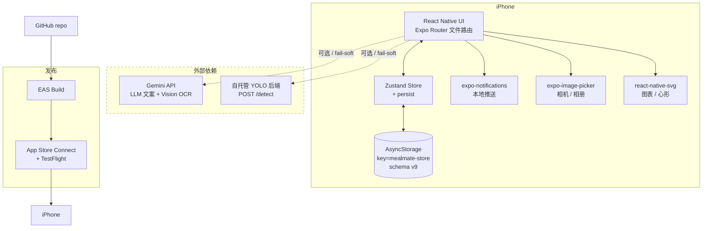
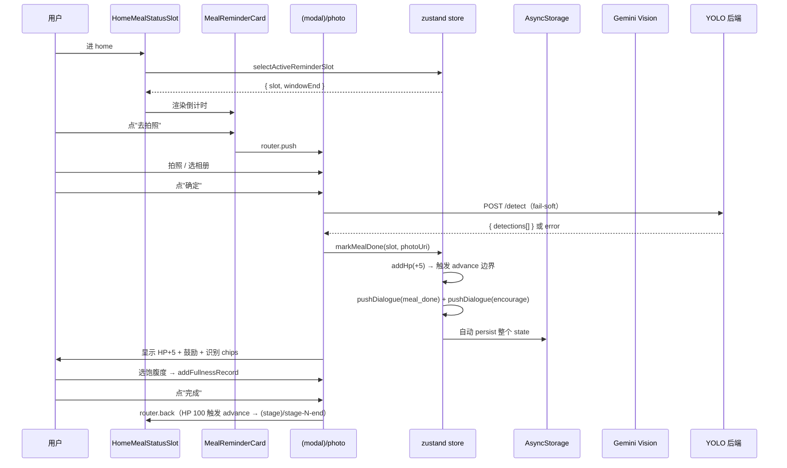

# 01 · 系统架构

## 顶层视图



## 关键设计原则

1. **客户端优先**：无后端 MVP。所有业务逻辑、状态、持久化都在客户端。
2. **fail-soft 外部依赖**：Gemini / YOLO 服务挂掉不阻塞核心打卡。本地兜底（文案池 / 手填 kg）。
3. **HP 是情感驱动器**：所有 HP 变更走统一 `addHp(delta)` 边界，>=100 → advanceStage / <0 → demoteStage。
4. **安全伦理硬约束**：敏感用户群体，所有文案 / 反馈走 [PRD §八 + §11.L](./PRD.md) —— stage 1 HP→0 走 support 调建议医生而非惩罚。
5. **数据本地优先**：用户数据仅存设备（AsyncStorage），跨设备 / 备份是 v1.1+ 才做。

## 技术栈

| 层 | 技术 | 选型理由 |
|---|---|---|
| UI | React Native + Expo SDK | [ADR-0001](./07-adr/0001-expo-vs-bare-rn.md) Expo 速度 + EAS Build + OTA |
| 路由 | Expo Router 文件路由 | 跟 Expo 配套，文件结构即路由 |
| 状态 | Zustand v5 + persist | [ADR-0004](./07-adr/0004-zustand-state.md) 轻量 + 中间件支持 |
| 持久化 | AsyncStorage | 配合 zustand persist，schema migrate v1→v9 |
| 推送 | expo-notifications 本地通知 | [ADR-0006](./07-adr/0006-local-notifications-not-apns.md) MVP 不需远程推送 |
| 图表 | react-native-svg | 心形条 / 趋势图 / icon |
| 样式 | NativeWind v4 + tokens.ts | tokens 是 inline style 的真源，NativeWind 是 className 真源（短期内手工同步） |
| LLM | 直连 Gemini API | [ADR-0005](./07-adr/0005-llm-key-client-exposure.md) 临时方案，v1.1 必迁 Worker |
| 食物识别 | 自托管 YOLO | [ADR-0007](./07-adr/0007-yolo-self-host-detection.md) 自建后端 fail-soft |
| 发布 | EAS Build + TestFlight | 一键云 build，无需本地 Xcode 链 / cert 管理 |

## 路由结构

```
app/
├── index.tsx             入口 router：onboardingDone 判断
├── _layout.tsx           RootLayout（推送 / missed scan / 跨日 reset）
├── onboarding/           3 步：eating / schedule / name
├── (main)/               4 底部 tab
│   ├── home              首页（HP / mascot / 下一餐 / 加餐 / 今日记录）
│   ├── records           记录（按日期 group 的 feed）
│   ├── stats             统计（爱心 + 体重趋势）
│   └── settings          我的（设置 + __DEV__ 面板）
├── (modal)/              modal presentation 屏
│   ├── photo             餐次拍照打卡 + 食物识别 + 加餐复用
│   ├── weight-entry      体重录入 + OCR
│   ├── meal-reminder     餐次提醒（通知点击次入口）
│   └── meal-missed       错过餐 modal
└── (stage)/              page presentation 全屏（11 个）
    ├── stage-1-start
    ├── stage-{1..5}-end
    └── stage-{1..5}-demote
```

详 [`03-modules/`](./03-modules/) 各模块说明。

## 状态层

单一 Zustand store at `app/src/store/useStore.ts`：

```
State:
  hp / currentStage / companionLv / robotName / gentleMode
  mealSchedules / todayMeals / todayKey
  mealHistory / weightHistory / fullnessHistory / mealRecords / dialogueHistory
  skipWeightPhoto / disappearWarningLastShownAt / onboardingDone
  transitionsSeen / transitionsPending

Actions (节选):
  markMealDone / markMealMissed / addHp / advanceStage / demoteStage
  addWeightRecord / addFullnessRecord / acknowledgeMissedMeal
  pushDialogue / makeUpMeal*（已弃用，feat/issue-3-makeup-meal 分支） / addSnack（feat/issue-3-snack-card）
  __dev_*（仅 __DEV__ 守卫的开发面板用）

Persist:
  key: mealmate-store
  version: 9（含 migrate v1→v9 全部）
  storage: AsyncStorage
```

详 [`04-data-model/`](./04-data-model/)。

## 数据流（典型：拍照打卡）



## 外部依赖契约

详 [`05-api/api-guide.md`](./05-api/api-guide.md)。简表：

| 依赖 | 失败行为 | Fallback |
|---|---|---|
| Gemini LLM（mascotLlm.ts） | 任何错 → null | 本地文案池 24 条 |
| Gemini Vision OCR（weightOcr.ts） | 任何错 → null | 用户手填 kg |
| YOLO 后端（foodDetection.ts） | 12s timeout / 网络错 → throw | photo 屏显示"识别服务没连上"+ 餐照常打卡 |
| expo-notifications | 权限拒绝 | 不调度，依赖用户主动开 app |

## 安全与隐私

- 数据全部本地，无云端
- 拍照走系统权限 prompt（NSCameraUsageDescription / NSPhotoLibraryUsageDescription）
- 推送本地，不上服务器
- 删账号 = resetAll 清本地（30 天 backup 是 v1.1+ 后端规划）
- **API key 在客户端 bundle**：临时风险，详 [ADR-0005](./07-adr/0005-llm-key-client-exposure.md)，v1.1 必迁 Worker

## 已识别风险

| 风险 | 影响 | 缓解 / 时间表 |
|---|---|---|
| 安全伦理（敏感用户） | 用户自责 / 焦虑加剧，PRD §八 列出的所有 loss-framed 表达 | 已实施 §11.L stage 1 HP→0 走 support 调；temperate mode 开关；正式上线前隐私政策加敏感用户提示 |
| Gemini key 暴露 | 反编译 ipa 拿 key 滥用配额 | v1.1 Cloudflare Worker 代理（[ADR-0005](./07-adr/0005-llm-key-client-exposure.md)） |
| 数据无备份 | 用户换机 / 卸载即丢全部记录 | v1.1+ Apple Sign In + 后端 sync，详 [04-data-model/tables.md](./04-data-model/tables.md) v1.1 schema |
| 无用户行为分析 | 拿不到 retention / 卡点数据 | v1.1 加 Sentry / 隐私友好的事件统计 |
| YOLO 后端单点 | 自托管挂掉所有用户食物识别失效 | 已 fail-soft（不阻塞打卡）；v1.1 可迁公有云 GPU 节点 |
