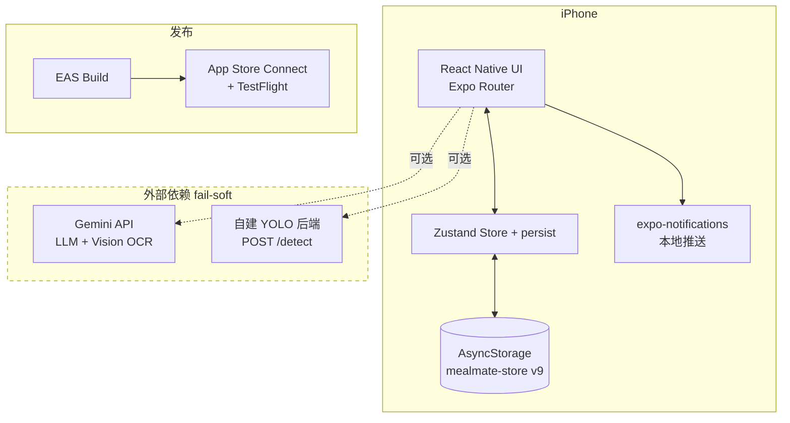

# 01 · 系统架构

## 顶层视图



## 关键原则

1. **客户端优先 / 无后端**（[ADR-0002](./07-adr/0002-client-only-no-backend.md)）。所有业务逻辑 + 状态 + 持久化都在客户端。
2. **fail-soft 外部依赖**：Gemini / YOLO 挂不阻塞核心打卡，本地兜底（文案池 / 手填 kg）
3. **HP 统一边界**：所有 HP 变更走 `addHp(delta)`，>=100 advance / <0 demote
4. **安全伦理硬约束**：敏感用户群体，文案 / 反馈走 [PRD §八 + §11.L](./PRD.md) —— stage 1 HP→0 走 support 调建议医生
5. **数据本地优先**：仅设备 AsyncStorage，跨设备 / 备份是 v1.1+

## 技术栈

| 层 | 技术 | 选型 |
|---|---|---|
| UI | React Native + Expo SDK 54 | [ADR-0001](./07-adr/0001-expo-vs-bare-rn.md) Expo |
| 路由 | Expo Router 文件路由 | 与 Expo 配套 |
| 状态 | Zustand v5 + persist | [ADR-0003](./07-adr/0003-minor-tech-choices.md) |
| 持久化 | AsyncStorage（schema migrate v1→v9） | 同上 |
| 推送 | expo-notifications 本地通知 | [ADR-0003](./07-adr/0003-minor-tech-choices.md) "本地通知"节 |
| 图表 | react-native-svg（自绘） | 自绘心形 + 折线 |
| 样式 | NativeWind v4 + tokens.ts | tokens 是真源 |
| LLM | 直连 Gemini API（**v1.1 必迁 Worker**） | [ADR-0005](./07-adr/0005-llm-key-client-exposure.md) |
| 食物识别 | 自托管 YOLO | [ADR-0003](./07-adr/0003-minor-tech-choices.md) "YOLO"节 |
| 发布 | EAS Build + TestFlight | 一键云 build |

## 路由结构

```
app/
├── index.tsx              入口 router：onboardingDone 判断
├── _layout.tsx            RootLayout（推送 / missed scan / 跨日 reset）
├── onboarding/            3 步：eating / schedule / name
├── (main)/                4 底部 tab：home / records / stats / settings
├── (modal)/               modal：photo / weight-entry / meal-reminder / meal-missed
└── (stage)/               page presentation 全屏：stage-1-start / stage-{1..5}-end / stage-{1..5}-demote
```

详 [`03-modules/`](./03-modules/) 各模块说明。

## 状态层

单一 Zustand store at `app/src/store/useStore.ts`。

字段 / 类型 / migrate 函数详 [`04-data-model/tables.md`](./04-data-model/tables.md)（最终 source of truth 是代码：`app/src/types/index.ts` + `useStore.ts`）。

## 外部依赖契约

| 依赖 | 失败 → | Fallback |
|---|---|---|
| Gemini LLM（`mascotLlm.ts`） | 任何错 → null | 本地文案池 24 条 |
| Gemini Vision OCR（`weightOcr.ts`） | 任何错 → null | 用户手填 kg |
| YOLO（`foodDetection.ts`） | 12s timeout / 网络错 | photo 屏显示"识别服务没连上" + 餐照常打卡 |
| expo-notifications | 权限拒绝 | 不调度，依赖用户主动开 app |

详 [`05-api/api-guide.md`](./05-api/api-guide.md)。

## 已识别风险

| 风险 | 缓解 |
|---|---|
| 安全伦理（敏感用户） | PRD §八 + §11.L；stage 1 HP→0 走 support 调；gentle mode 开关 |
| Gemini key 暴露 | v1.1 必迁 Cloudflare Worker（[ADR-0005](./07-adr/0005-llm-key-client-exposure.md)） |
| 数据无备份 | v1.1+ Apple Sign In + 后端 sync |
| YOLO 后端单点 | 已 fail-soft；v1.1+ 迁公有云 GPU |
