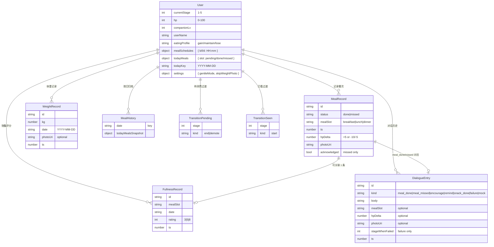

# 数据实体关系（ER）

mealmate 是 client-only app，"数据库"是 AsyncStorage 里的 `mealmate-store` JSON。下面是逻辑实体图。

## 实体关系图

## 核心关系说明

- **User 1 : N MealRecord**：每个 slot 每天最多 1 条（dedup 由 todayMeals + markMealDone 内部保证）
- **MealRecord 1 : 0/1 FullnessRecord**：拍完餐可选填饱腹度，没填就没关联
- **MealRecord 1 : 0/N DialogueEntry**：markMealDone 触发 meal_done + encourage 两条 dialogue，markMealMissed 触发 meal_missed + remind 两条
- **WeightRecord** 按 date 唯一（同日覆盖）
- **MealHistory** 是 todayMeals 的按日归档（跨日 rollDayIfNeeded 时把当日 todayMeals 写入）

## 不变量

- `hp ∈ [0, 100]`
- `currentStage ∈ [1, 5]`
- 每个 `(slot, date)` 在 `MealRecord` 中至多一条
- 每个 `(slot, date)` 在 `FullnessRecord` 中至多一条
- 每个 `date` 在 `WeightRecord` 中至多一条
- `todayMeals[slot] === 'done' ⇒ 存在对应 MealRecord(status='done', mealSlot=slot)`

## 不持久化的字段

- modal 内部 state（phase / imageUri / kgInput）—— 关 modal 即丢
- detections（YOLO 返回）—— 仅 result phase 用，不存
- 网络请求中间状态 / loading flag

## 删除策略

**全部 append-only**，用户不能删除单条记录（防作弊 + 留档）。唯一删的入口是 settings.resetAll() 全清。

后续考虑（v1.1+）：dialogueHistory 保留最近 90 天，超出归档到本地 SQLite。
